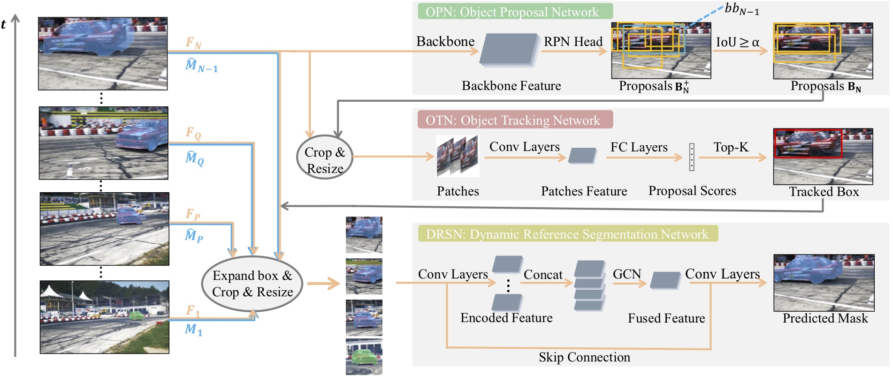

# Proposal, Tracking and Segmentation (PTS): A Cascaded Network for Video Object Segmentation
By [Qiang Zhou\*](http://blog.hypotheses.cc), [Zilong Huang\*](http://speedinghzl.github.io), [Lichao Huang](https://scholar.google.com/citations?user=F2e_jZMAAAAJ&hl=en), [Shen Han](han.shen@horizon.ai), [Yongchao Gong](yongchao.gong@horizon.ai), [Chang Huang](https://scholar.google.com/citations?user=IyyEKyIAAAAJ&hl=zh-CN), [Wenyu Liu](http://mclab.eic.hust.edu.cn/MCWebDisplay/PersonDetails.aspx?Name=Wenyu%20Liu), [Xinggang Wang](http://www.xinggangw.info/index.htm).(\* means equal contribution)

This code is the implementation mainly for DAVIS 2017 dataset. For more detail, please refer to our [paper](https://arxiv.org/abs/1907.01203).

## Architecture
<div align='center'><br></div>

Overview of our proposed PTSNet for video object segmentation. **OPN** is designed for generating proposals of the interested objects and **OTN** aims to distinguish which one of the proposals is the best. Finally, **DRSN** does the final pixel level tracking(segmentation) task. Note in our implementation we couple **OPN** and **OTN** as a whole network, and spearate **DRSN** out under engineering consideration.

## Usage

### Preparation

1. Install [PyTorch 1.0](https://github.com/pytorch/pytorch#installation) and necessary libraries like opencv, PIL etc.

2. There are some native CUDA implementations, **InPlace-ABN** and **MaskRCNN Operators**, which must be compiled at the very start.
	```Bash
	# Before you compile, you need to figure out several things:
	# - The CUDA kernels supported by your GPU, here we use `sm_52`, `sm_61` and `sm_70` for NVIDIA Titan V.
	# - `cuda` and `nvcc` paths in your operating system, which exist usually in `/usr/local/cuda` and `/usr/local/cuda/bin/nvcc` respectively.
	# InPlace-ABN_0.4   (Pytorch 0.4 supported)
	cd model/inplace_ABN
	bash build.sh
	python3 build.py
	# MaskRCNN Operators
	cd coupled_otn_opn/tracking/maskrcnn/lib
	bash make.sh
    # InPlace-ABN_1.0
    # Dynamic compiled, please check in drsn/model/inplace_ABN
	```

3. You can train PTSNet from scratch or just evaluate our pretrained model.
	- Train it from scratch, you need to download:

		```Bash
		# DRSN: wget "https://download.pytorch.org/models/resnet50-19c8e357.pth" -O drsn/init_models/resnet50-19c8e357.pth
		# OPN: wget "https://drive.google.com/open?id=1ma1fNmEvS9dJLOIcm1FRzYofVS_t3aI3" -O coupled_otn_opn/tracking/maskrcnn/data/X-152-32x8d-IN5k.pkl
		# If you want to use our pretrained OTN:
        #   wget https://drive.google.com/open?id=12bF1dRlEUZoQz3Qcr2WD3ojqNHzbCrjf, put it into `coupled_otn_opn/models/mdnet_davis_50cyche.pth`
		# Else please modify from py-MDNet(https://github.com/HyeonseobNam/py-MDNet) to train OTN on DAVIS by yourself.
		```
	- If you want to use our pretrained model to do the evaluation, you need to download:

		```Bash
		# DRSN: https://drive.google.com/open?id=116yXnqX43BZ7kEgdzUhIeTSn1dbvcE2F, put it into `drsn/snapshots/drsn_yvos_10w_davis_3p5w.pth`
		# OPN: wget "https://drive.google.com/open?id=1ma1fNmEvS9dJLOIcm1FRzYofVS_t3aI3" -O coupled_otn_opn/tracking/maskrcnn/data/X-152-32x8d-IN5k.pkl
		# OTN: https://drive.google.com/open?id=12bF1dRlEUZoQz3Qcr2WD3ojqNHzbCrjf, put it into `coupled_otn_opn/models/mdnet_davis_50cycle.pth`
		```

4. Dataset
	- **YouTube-VOS**: Download from [YouTube-VOS](https://youtube-vos.org/dataset/download), note we only need the training part(`train_all_frames.zip`), totally about 41G. Unzip, move and rename it to `drsn/dataset/yvos`.
	- **DAVIS**: Download from [DAVIS](https://davischallenge.org/challenge2018/semisupervised.html), note we only need the 480p version(`DAVIS-2017-trainval-480p.zip`). Unzip, move and rename it to `drsn/dataset/DAVIS/trainval` and `coupled_otn_opn/DAVIS/trainval`. Here you need to make a subdirectory of `trainval` directory to store the dataset.

	And make sure to put the files as the following structure:

	```
	.
	├── drsn
	│   ├── dataset
	│   │   ├── DAVIS
	│   │   │   └── trainval
	│   │   │       ├── Annotations
	│   │   │       ├── ImageSets
	│   │   │       └── JPEGImages
	│   │   └── yvos
	│   │       └── train_all_frames
	│   ├── init_model
	│   │   └── resnet50-19c8e357.pth
	│   └── snapshots
	│       └── drsn_yvos_10w_davis_3p5w.pth
	└── coupled_otn_opn
	    ├── DAVIS
	    │   └── trainval
	    ├── models
	    │   └── mdnet_davis_50cycle.pth
	    └── tracking
	        └── maskrcnn
	            └── data
	                └── X-152-32x8d-FPN-IN5k.pkl
	```


### Train and Evaluate
- Firstly, check the directory of `coupled_otn_opn` and follow the `README.md` inside to generate our proposals. You can also skip this step for we have provided generated proposals in `drsn/dataset/result_davis` directory. 
- Secondly, enter `drsn` and check `do_train_eval.sh` to train and evaluate.
- Finally, we also provide result masks by our PTSNet in [result-masks-GoogleDrive](https://drive.google.com/open?id=1K4hhByjEvDnDPrkJMLWlEDvYV446I7Nh). The quantitative results are measured by [DAVIS official matlab toolbox](https://github.com/davisvideochallenge/davis-matlab).

|        | J Mean | F Mean | G Mean |
|:------:|:------:|:------:|:------:|
| Avg    | 71.6   | 77.7   | 74.7  |


## Acknowledgment
The work was mainly done during an internship at [Horizon Robotics](http://horizon.ai/).


## Thanks to the Third Party Libs
- [py-MDNet](https://github.com/HyeonseobNam/py-MDNet)
- [detectron.pytorch](https://github.com/roytseng-tw/Detectron.pytorch)
- [OSMN](https://github.com/linjieyangsc/video_seg)
- [InPlace-ABN](https://github.com/mapillary/inplace_abn)
